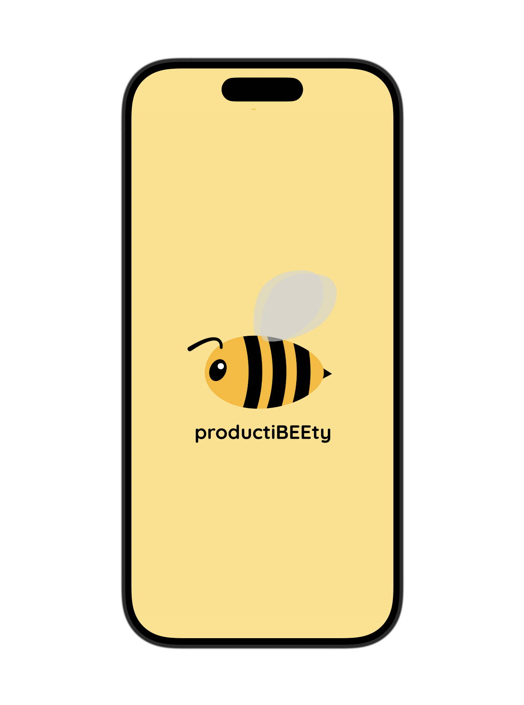
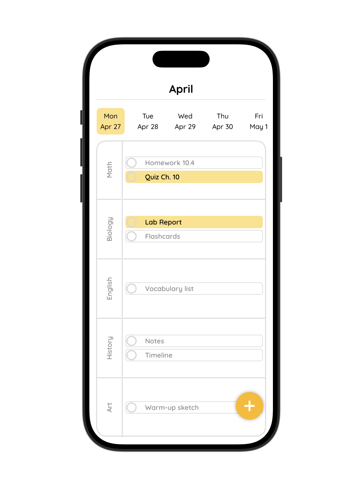
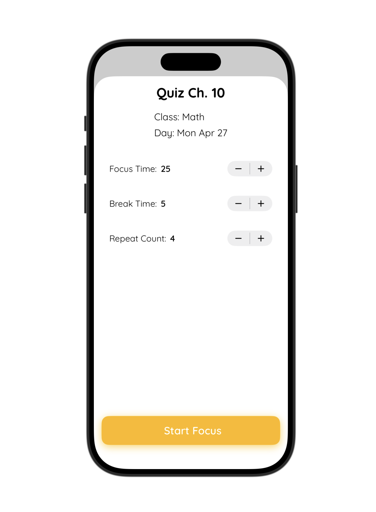
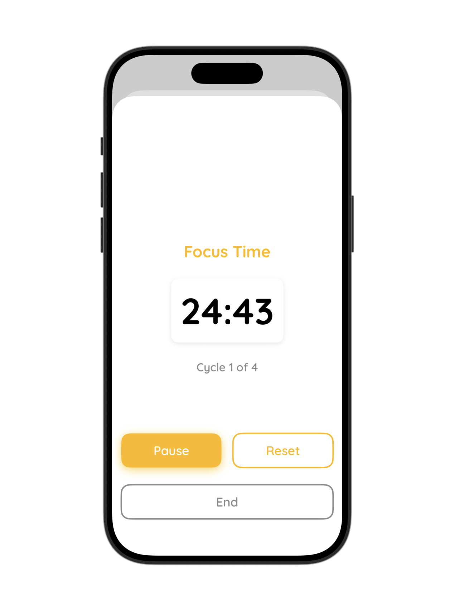

# "productiBEEty"

## Description
ProductiBEEty is a friendly and simple iOS application designed to help high school and college students combat procrastination by prioritizing urgent assignments. Built with **SwiftUI**, this app transforms a static design concept into a functional native experience. It features a day-view calendar grid organized by class and date, allowing students to visualize their workload at a glance. By tapping on an assignment, users can configure a custom Pomodoro timer that automatically cycles between focus and break periods, keeping them on track without manual intervention. The app retains the signature "bee" theme and a warm, encouraging aesthetic to make productivity feel approachable.

## Screenshots

## Features
- **Day-View Calendar:** A vertical grid listing classes on the Y-axis and days/dates on the X-axis. Swipe left or right to navigate between days.
- **Urgent Assignment Highlighting:** Urgent tasks are highlighted in the signature accent color (#FEB800), while standard tasks feature a subtle gray stroke.
- **Custom Pomodoro Timer:** Click any assignment to set focus time, break time, and repetition cycles. The timer automatically alternates between work and rest modes.
- **Task Completion Tracking:** A built-in checkbox feature allows students to mark assignments as completed directly from the main view.
- **Splash Screen:** A branded entry screen that loads upon opening the app.

## Installation & Setup
1. Clone the repository to your local machine.
2. Open the project in **Xcode** (requires macOS).
3. Ensure you have the latest version of **SwiftUI** and **Swift** installed.
4. Select a simulator (iPhone) or physical device from the toolbar.
5. Click the **Run** button (▶️) to build and launch the app.

## Challenges & Reflection
Developing this app presented unique challenges in translating a highly detailed Figma prompt into code. Initially, attempts to dictate every detail and formatting rule resulted in rigid, error-prone outputs. The breakthrough came when I shifted to a more collaborative approach with the AI coding assistant, providing broad structural goals and allowing the code to determine the optimal formatting. This flexibility led to a cleaner, more functional layout than the original rigid specification.

Version control via **GitHub** proved essential. By committing significant changes with descriptive messages, I was able to experiment with new features (like editing capabilities) and revert to stable versions when those additions disrupted the core layout. This iterative process taught me the value of letting go of total control to achieve a better final product.

## Next Steps
While the current version is stable and functional, there are opportunities for future enhancement:
- **Animated Splash Screen:** Implementing a smooth, animated transition for the startup screen.
- **CRUD Functionality:** Fully integrating the ability to edit, delete, and dynamically add new assignments without breaking the layout.
- **Data Persistence:** Ensuring assignment data persists across app restarts using local storage (e.g., CoreData or SwiftData).

## Technologies Used
- **Language:** Swift
- **Framework:** SwiftUI
- **Version Control:** Git / GitHub
- **Design Reference:** Figma (Original Prototype)

## License
This project is for educational and portfolio purposes.
